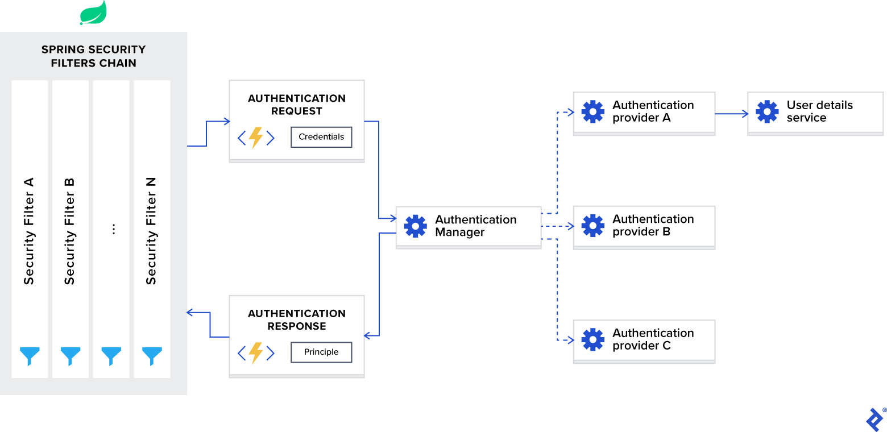

# This example context in `Book Store Web Application`

Ref : [SpringBootSecurityJwt](https://www.toptal.com/spring/spring-security-tutorial)

## Spring Security Architecture



- ### Spring Security Filters Chain

  When you add the Spring Security framework to your application, it automatically registers a filters chain that intercepts all incoming requests. This chain consists of various filters, and each of them handles a particular use case.

  For example:

  - Check if the requested URL is publicly accessible, based on configuration.

  - In case of session-based authentication, check if the user is already authenticated in the current session.

  - Check if the user is authorized to perform the requested action, and so on.

  One important detail I want to mention is that Spring Security filters are registered with the lowest order and are the first filters invoked. For some use cases, if you want to put your custom filter in front of them, you will need to add padding to their order. This can be done with the following configuration:

  ```properties
  spring.security.filter.order=10
  ```

  Once we add this configuration to our application.properties file, we will have space for 10 custom filters in front of the Spring Security filters.

- ### AuthenticationManager

  You can think of `AuthenticationManager` as a coordinator where you can register multiple providers, and based on the request type, it will deliver an authentication request to the correct provider.

- ### AuthenticationProvider

  `AuthenticationProvider` processes specific types of authentication. Its interface exposes only two functions:

  - authenticate performs authentication with the request.

  - supports checks if this provider supports the indicated authentication type.

  One important implementation of the interface that we are using in our sample project is `DaoAuthenticationProvider`, which retrieves user details from a `UserDetailsService`.

- ### UserDetailsService

  `UserDetailsService` is described as a core interface that loads user-specific data in the Spring documentation.

  In most use cases, authentication providers extract user identity information based on credentials from a database and then perform validation. Because this use case is so common, Spring developers decided to extract it as a separate interface, which exposes the single function:

  - `loadUserByUsername` accepts username as a parameter and returns the user identity object.
